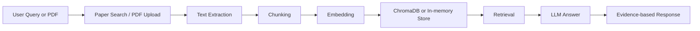

# AI Research Assistant

AI Research Assistant is a local-first academic paper assistant for literature search, PDF ingestion, structured summarisation, paper comparison, and retrieval-augmented question answering with citations.

The project is designed as a portfolio-quality AI application: it shows the full RAG pipeline instead of only wrapping a chat API.

## Why This Project Matters

Modern AI and data science work often starts with reading papers. This project demonstrates practical skills across LLM applications, information retrieval, PDF processing, embeddings, vector databases, evaluation, and user-facing demo design.

## Features

- Search arXiv and save paper metadata.
- Upload local PDFs and extract page-aware text.
- Clean and chunk paper text with source metadata.
- Build an in-memory or ChromaDB vector index.
- Ask questions against indexed papers.
- Return answers with evidence and confidence.
- Generate structured paper summaries.
- Compare multiple papers in a Markdown table.
- Run lightweight retrieval and citation checks.

## System Architecture



## Tech Stack

- Python
- Streamlit
- PyMuPDF
- arXiv API
- pandas
- sentence-transformers
- ChromaDB
- pytest
- Ollama or OpenAI-compatible API providers

## How To Run Locally

```bash
python -m venv .venv
.venv\Scripts\activate
python -m pip install -e ".[dev]"
python -m streamlit run app/streamlit_app.py
```

The default LLM provider is `mock`, so the app can start without an API key. Copy `.env.example` and set environment variables to use Ollama or an OpenAI-compatible API.

The Streamlit sidebar defaults to `SentenceTransformer + Chroma` for the real local RAG workflow. For a quick setup smoke test on a low-resource machine, switch the sidebar to `Hash demo + In-memory`.

## Example Queries

- What problem does retrieval-augmented generation solve?
- What limitations do the papers report about retrieval quality?
- Which evaluation metrics are used for retrieval performance?
- How do the indexed papers handle evidence or citations?

More examples are in `reports/demo_queries.md`.

## Evaluation

The project includes lightweight evaluation helpers:

- `Recall@k` for retrieval checks.
- citation presence checks for generated answers.
- insufficient-evidence behavior checks.

See `reports/evaluation_report.md`.

## Limitations

- Scanned PDFs need OCR, which is outside the MVP.
- Word-based chunking is clear and testable but not tokenizer-aware.
- Retrieval quality depends on the embedding model and indexed paper set.
- The system can only answer from uploaded and indexed papers.

## Future Work

- Semantic Scholar integration.
- BibTeX or Zotero export.
- Citation graph visualization.
- Docker packaging.
- Multi-embedding evaluation.

## CV Description

Built an AI research assistant for literature search, PDF parsing, structured paper summarisation, multi-paper comparison, and retrieval-augmented question answering. Implemented chunking, embedding, ChromaDB-based retrieval, and evidence-grounded answer generation, with evaluation using Recall@k and manually curated research questions.
