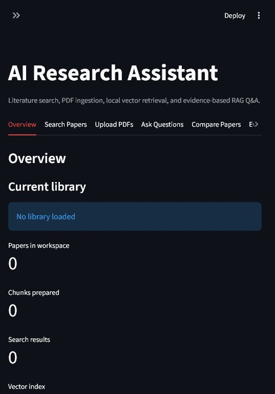
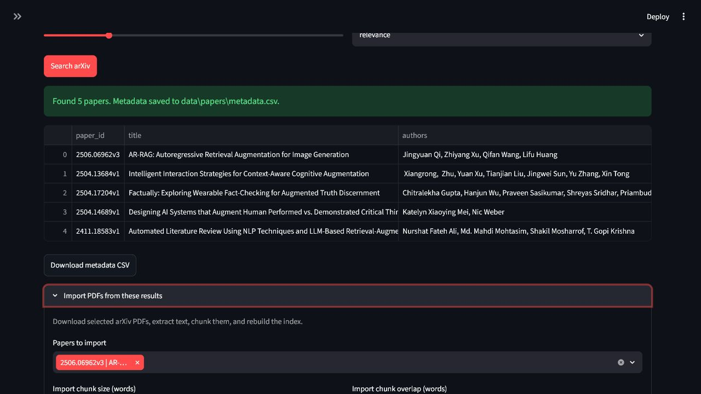

# AI Research Assistant

[](https://github.com/PoorJeff/ai-research-assistant/actions/workflows/ci.yml)


Local-first literature search, PDF ingestion, paper summarisation, paper comparison, and retrieval-augmented question answering with citation-backed evidence.

This project is built as a portfolio-grade AI application rather than a thin chat wrapper. It demonstrates the core pieces of an academic RAG system: PDF processing, chunking, embeddings, vector search, prompt design, evidence-grounded generation, and lightweight evaluation.

## Highlights

- Product overview dashboard with runtime, index, and benchmark status.
- Search arXiv papers and export metadata to CSV.
- Import selected arXiv PDFs directly from search results and rebuild the vector index.
- Upload research PDFs and extract page-aware text with PyMuPDF.
- Clean and chunk paper text while preserving source metadata.
- Build a local vector index with ChromaDB or an in-memory store.
- Ask questions against indexed papers with evidence and confidence.
- Generate structured paper summaries.
- Compare multiple papers in a Markdown table.
- Evaluate retrieval with Recall@k and answer citation checks.
- Run without an API key using the deterministic mock provider.
- Switch to Ollama or an OpenAI-compatible API for stronger generation.

## Product Snapshot

This is best read as a strong local-first research workflow and portfolio project, not a hosted multi-user SaaS product.

| dimension | score | note |
| --- | ---: | --- |
| Portfolio readiness | 92/100 | Complete pipeline, one-click paper import, tests, CI, Docker, screenshots, and reproducible real-paper evaluation. |
| End-user product readiness | 82/100 | Useful local workflow with clearer status, benchmark visibility, and repeatable launch path; still needs OCR and richer answer-quality evaluation. |
| Technical depth | 91/100 | Modular RAG architecture with page-aware chunks, swappable embeddings, vector stores, LLM providers, and tested ingestion utilities. |

The product polish added on top of the MVP focuses on the first-run experience: the app opens on an Overview page that exposes the active library state, runtime configuration, and latest real-paper benchmark before the user starts searching or uploading PDFs.

## Screenshots

### Overview Dashboard

The app opens with current workspace status and the latest real-paper evaluation metrics.



### arXiv Search


### One-Click arXiv PDF Import



### PDF Upload And Sample Indexing


### Evidence-Based RAG Answer


## Quick Start

### Windows PowerShell

```powershell
python -m venv .venv
.\.venv\Scripts\Activate.ps1
python -m pip install -e ".[dev]"
python -m streamlit run app/streamlit_app.py
```

### macOS / Linux

```bash
python -m venv .venv
source .venv/bin/activate
python -m pip install -e ".[dev]"
python -m streamlit run app/streamlit_app.py
```

Open the app at:

```text
http://localhost:8501
```

### Docker

```bash
docker build -t ai-research-assistant .
docker run --rm -p 8501:8501 ai-research-assistant
```

## One-Minute Demo

1. Open the app.
2. Go to `Search Papers` and search for `retrieval augmented generation`.
3. Go to `Upload PDFs` and click `Load sample RAG demo`.
4. Go to `Ask Questions`.
5. Click `Answer with evidence`.
6. Inspect the `Answer`, `Evidence`, `Confidence`, and retrieved chunks.

The built-in sample demo uses a tiny in-memory index so the RAG flow can be tested before uploading real PDFs.

## Real Paper Workflow

1. Go to `Search Papers`.
2. Search for an arXiv topic.
3. Expand `Import PDFs from these results`.
4. Select one or more papers.
5. Click `Download, extract, and index selected papers`.
6. Go to `Ask Questions` and ask against the newly indexed PDFs.

## System Architecture

```mermaid
flowchart LR
    A["User Query / PDF / arXiv Topic"] --> B["Search or Upload"]
    B --> C["PDF Text Extraction"]
    C --> D["Text Cleaning"]
    D --> E["Chunking with Metadata"]
    E --> F["Embeddings"]
    F --> G["ChromaDB / In-memory Store"]
    G --> H["Top-k Retrieval"]
    H --> I["Evidence-Bound Prompt"]
    I --> J["Answer + Evidence + Confidence"]
```



## Pipeline

1. `arxiv_search.py` queries arXiv and normalizes paper metadata.
2. `paper_ingestion.py` downloads selected arXiv PDFs and converts them into source-aware chunks.
3. `pdf_loader.py` extracts page-level text from uploaded or downloaded PDFs.
4. `text_cleaning.py` normalizes PDF text artifacts.
5. `chunking.py` splits text into overlapping source-aware chunks.
6. `embeddings.py` creates sentence-transformer or hash embeddings.
7. `vector_store.py` stores and retrieves chunks with ChromaDB or memory.
8. `rag_pipeline.py` retrieves top-k chunks and builds evidence-backed answers.
9. `summarizer.py` and `paper_compare.py` produce structured research outputs.
10. `evaluation.py` supports Recall@k and citation-presence checks.

## Project Structure

```text
ai-research-assistant/
├── app/
│   └── streamlit_app.py
├── src/
│   ├── arxiv_search.py
│   ├── chunking.py
│   ├── config.py
│   ├── demo_data.py
│   ├── embeddings.py
│   ├── evaluation.py
│   ├── llm_client.py
│   ├── models.py
│   ├── paper_compare.py
│   ├── paper_ingestion.py
│   ├── pdf_loader.py
│   ├── product_metrics.py
│   ├── prompts.py
│   ├── rag_pipeline.py
│   ├── summarizer.py
│   ├── text_cleaning.py
│   └── vector_store.py
├── docs/
│   ├── model_card.md
│   ├── prompt_design.md
│   ├── resume_entry.md
│   └── system_design.md
├── reports/
│   ├── demo_queries.md
│   ├── evaluation_report.md
│   ├── product_review.md
│   ├── real_paper_evaluation.md
│   └── system_limitations.md
└── tests/
```

## Model Configuration

The default `.env.example` configuration is API-free:

```text
AI_RA_LLM_PROVIDER=mock
AI_RA_EMBEDDING_MODEL=sentence-transformers/all-MiniLM-L6-v2
AI_RA_CHROMA_PATH=vectorstore
```

Supported LLM providers:

- `mock`: deterministic offline responses for tests and demos.
- `ollama`: local model serving through Ollama.
- `openai_compatible`: any API with an OpenAI-style `/chat/completions` endpoint.

The Streamlit sidebar defaults to `SentenceTransformer + Chroma` for the real local RAG workflow. For quick setup checks, use `Hash demo + In-memory`.

## Answer Format

RAG answers follow a fixed evidence contract:

```text
Answer:
...

Evidence:
[1] Paper title, page/chunk, source
[2] Paper title, page/chunk, source

Confidence:
High / Medium / Low
```

If retrieved context is insufficient, the system returns a low-confidence insufficient-evidence answer instead of inventing a conclusion.

## Evaluation

The MVP includes lightweight evaluation helpers for:

- `Recall@k` retrieval checks.
- Citation presence in generated answers.
- Insufficient-evidence behavior when retrieval returns no useful chunks.

The current real-paper evaluation uses three arXiv PDFs:

| paper id | paper | pages | chunks |
| --- | --- | ---: | ---: |
| `2005.11401` | Retrieval-Augmented Generation for Knowledge-Intensive NLP Tasks | 19 | 20 |
| `2404.16130` | From Local to Global: A Graph RAG Approach to Query-Focused Summarization | 26 | 31 |
| `2309.15217` | Ragas: Automated Evaluation of Retrieval Augmented Generation | 8 | 10 |

Latest reproducible run:

| metric | result |
| --- | ---: |
| Evaluation questions | 6 |
| Average Recall@3 | 1.00 |
| Average Recall@5 | 1.00 |
| Citation coverage | 6/6 |

Run the evaluation yourself:

```bash
python scripts/run_real_paper_evaluation.py --embedding-backend sentence-transformer
```

Demo questions live in `reports/demo_queries.md`. The evaluation method and real-paper results are documented in `reports/evaluation_report.md` and `reports/real_paper_evaluation.md`.

## Tests

```bash
python -m pytest -v
python -m ruff check .
python -m compileall src app scripts
```

GitHub Actions runs the unit tests, lint, and compile checks on every push and pull request to `main`. The real-paper evaluation is intentionally kept as a manual command because it downloads arXiv PDFs and may download embedding-model weights.

Current coverage focuses on:

- config defaults,
- arXiv metadata conversion,
- PDF loading,
- arXiv PDF ingestion,
- chunking and overlap,
- Docker packaging files,
- vector retrieval,
- prompt and LLM client behavior,
- RAG answer evidence formatting,
- evaluation helpers,
- built-in demo data,
- Streamlit syntax smoke checks.

## Limitations

- Scanned PDFs require OCR, which is outside the MVP.
- Word-based chunking is transparent and testable but not tokenizer-aware.
- Retrieval quality depends on the embedding model and indexed paper set.
- The app can only answer from uploaded and indexed content.
- The mock LLM is useful for testing but not a replacement for a real reasoning model.

## Future Work

- Add OCR support for scanned papers.
- Add Semantic Scholar metadata.
- Add BibTeX or Zotero export.
- Add citation graph exploration.
- Add richer retrieval and answer-quality evaluation.
- Add screenshots and metrics from a larger real-paper benchmark.

## CV Description

Built an AI research assistant for literature search, one-click arXiv PDF ingestion, PDF parsing, structured paper summarisation, multi-paper comparison, and retrieval-augmented question answering. Implemented chunking, embedding, ChromaDB-based retrieval, evidence-grounded answer generation, Docker packaging, CI, and lightweight evaluation with Recall@k and manually curated research questions.

Resume-ready bullets are available in `docs/resume_entry.md`.
