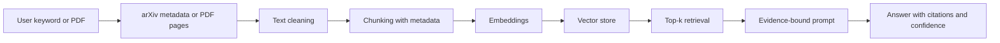

# System Design

## Overview

AI Research Assistant is a local-first RAG application for academic papers. It helps a user search paper metadata, upload PDFs, extract text, chunk papers, build a vector index, ask evidence-grounded questions, summarize papers, compare papers, and run lightweight evaluation checks.

## Architecture



The Streamlit app is intentionally thin. Core behavior lives in `src/` modules so the pipeline can be tested without a UI.

## Chunking Strategy

The MVP uses word-based chunks with overlap. Defaults are 700 words per chunk and 120 words of overlap. This is transparent, easy to test, and robust across machines without tokenizer-specific dependencies.

Every chunk stores:

- `paper_title`
- `paper_id`
- `page_number`
- `chunk_id`
- `source_url`

Token-aware chunking is a natural future improvement, especially when targeting a specific LLM context window.

## Retrieval And Generation

Embeddings are generated by either:

- `sentence-transformers/all-MiniLM-L6-v2` for semantic retrieval, or
- `HashEmbeddingModel` for fast offline tests and setup checks.

The vector store can be in-memory for demos or ChromaDB for persistent local indexes. RAG answers are generated through a provider abstraction that supports mock, Ollama, and OpenAI-compatible APIs.

## Evidence Contract

The RAG pipeline returns:

```text
Answer:
...

Evidence:
[1] Paper title, page/chunk, source

Confidence:
High / Medium / Low
```

If no useful chunks are retrieved, the pipeline returns a deterministic low-confidence insufficient-evidence answer without calling the LLM.
